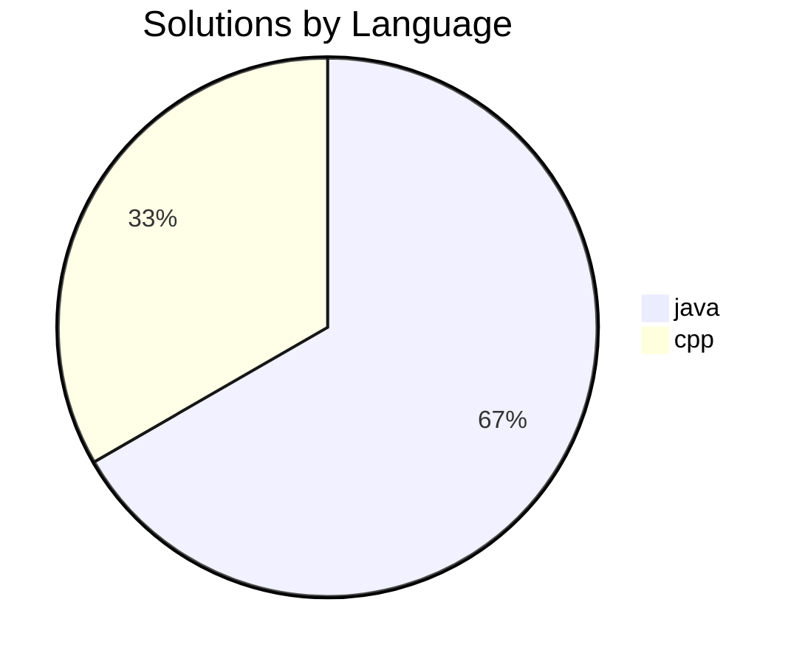

# LeetCode Auto-Sync 🏆

This repository contains my automatically synced LeetCode solutions.

## 📊 Statistics

* **Total Problems Solved:** 2
* **Total Submissions Saved:** 3

### Language Breakdown

## 📝 Solutions

| ID | Problem | Languages |
| :--- | :--- | :--- |
| 0002 | [Add Two Numbers](./solutions/0002%20-%20Add%20Two%20Numbers) | `java` |
| 3622 | [Check Divisibility by Digit Sum and Product](./solutions/3622%20-%20Check%20Divisibility%20by%20Digit%20Sum%20and%20Product) | `cpp`, `java` |